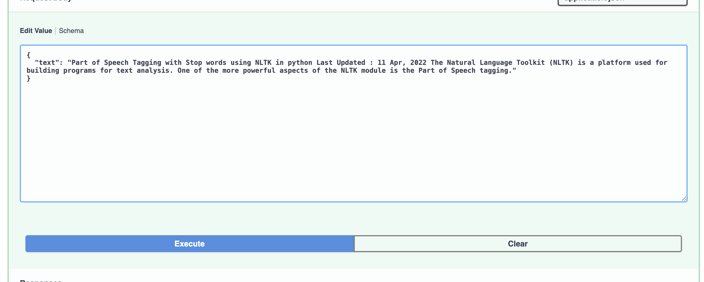
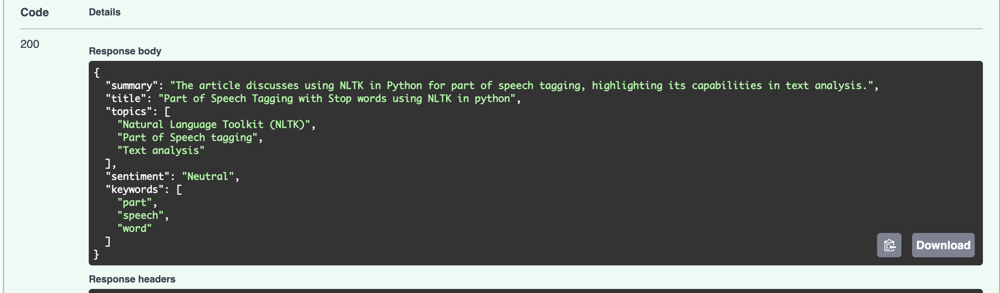
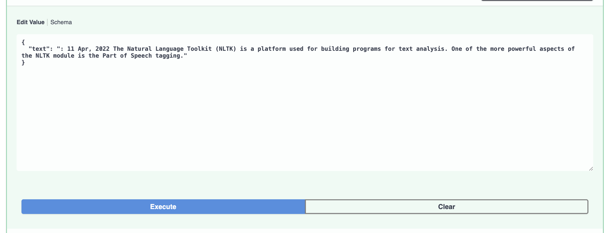
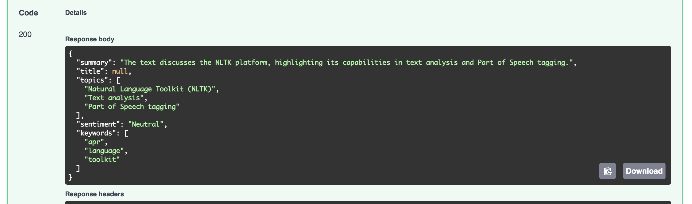

# Dependencies 
Install dependencies: `pip install -r requirements.txt`

# How to run
* Run `fastapi dev app.py`
* Go to `http://127.0.0.1:8000/docs`

# Design and tool choices
* Openai with structured outputs: easy to set up and get outputs that follow schema consistently
* fastapi: easy to set up and async is good for i/o tasks and light cpu tasks

# Examples(with and without title)

