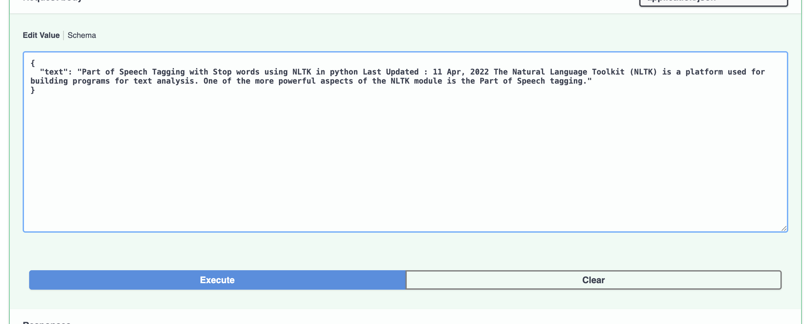
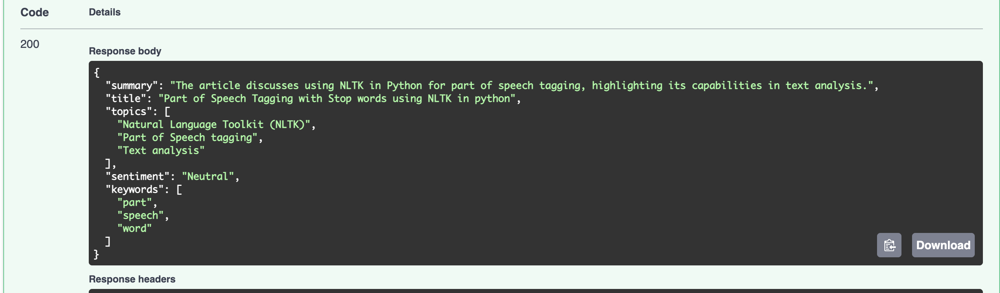
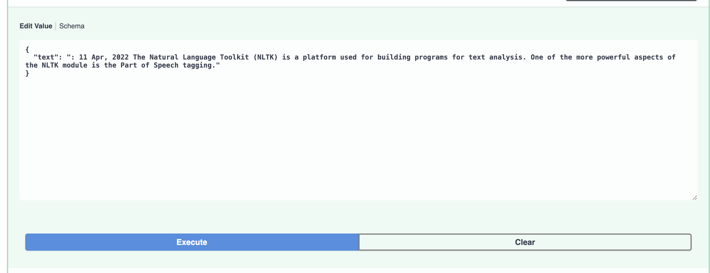
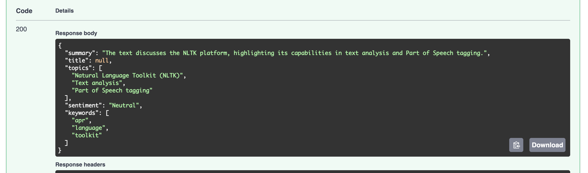

## Getting Started

### Install dependencies

* `pip install - requirements.txt`
* put your key `client_async = AsyncOpenAI(api_key="")` in app.py

### Run

* `fastapi dev app.py`
* Open `http://127.0.0.1:8000/docs` and test

## Design and tool choices
* Used pydantic and openai to get structured outputs: easy way to make sure responses follow the schema
* Fastapi for api: easy to set up and async is good for api or i/o or lightweight tasks
* Could have organized it a bit better

## Demo(with and without title in the text)

